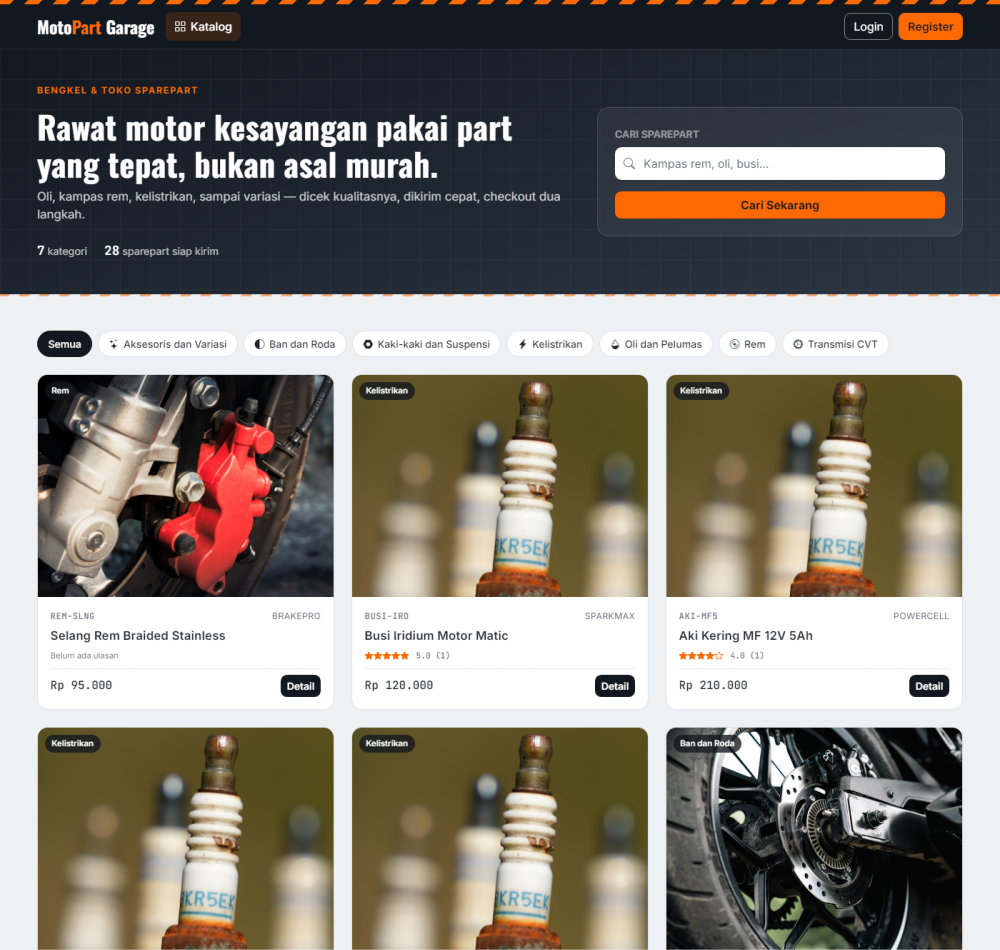
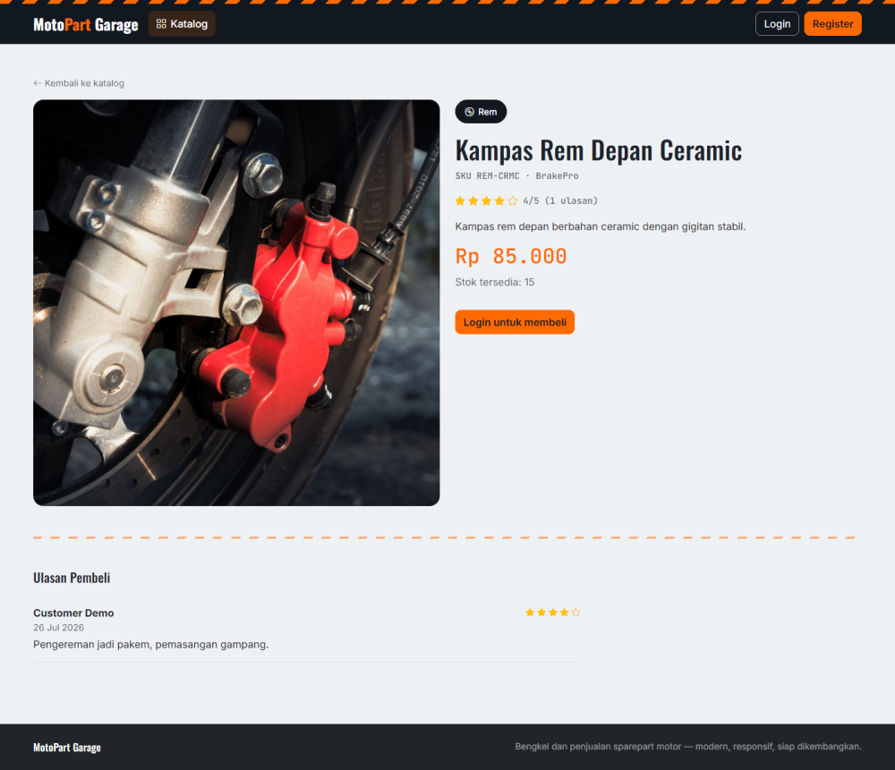
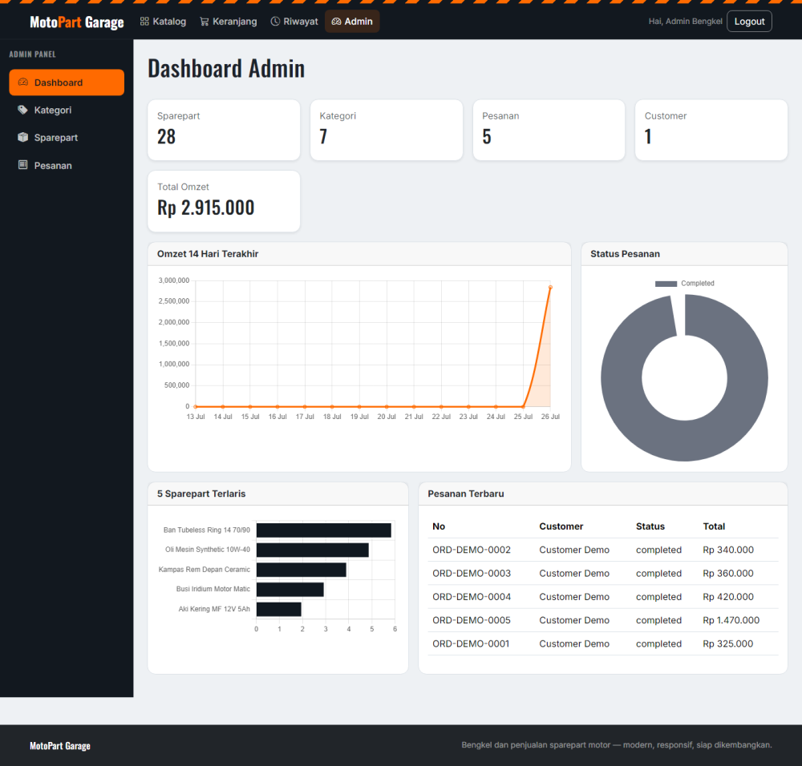

<p align="center">
  
</p>

<h1 align="center">MotoPart Garage</h1>

<p align="center">
  Website bengkel &amp; toko sparepart motor — Laravel 13, Blade, Bootstrap 5, dan integrasi pembayaran Midtrans Snap.
</p>

<p align="center">
  
  
  
</p>

## Tentang Proyek

MotoPart Garage adalah aplikasi web untuk bengkel dan penjualan sparepart motor. Ada dua role: **customer** untuk belanja sparepart dari katalog sampai pembayaran online, dan **admin** untuk mengelola kategori, produk, dan pesanan lewat dashboard dengan grafik penjualan.

## Fitur

**Customer**
- Cari & filter sparepart per kategori, dengan pagination
- Detail produk lengkap dengan rating & ulasan pembeli
- Keranjang belanja dan checkout
- Pembayaran online via **Midtrans Snap** (kartu, VA, e-wallet, dll — sandbox)
- Timeline riwayat status pesanan (pending → paid → processing → completed)
- Unduh invoice pesanan dalam format PDF
- Beri ulasan & rating untuk produk dari pesanan yang sudah selesai
- Notifikasi email saat pesanan dibuat dan saat status berubah

**Admin**
- Dashboard dengan grafik omzet 14 hari terakhir, status pesanan, dan produk terlaris (Chart.js)
- CRUD kategori & sparepart, termasuk upload foto produk
- Kelola pesanan dan ubah status (otomatis mengembalikan stok bila dibatalkan)

<p align="center">
  
  
</p>

## Tech Stack

- **Backend**: Laravel 13, PHP 8.3+
- **Frontend**: Blade, Bootstrap 5 & Bootstrap Icons (CDN), Chart.js
- **Database**: SQLite (default lokal) / MySQL (opsional, lihat [docs/DOKUMENTASI.md](docs/DOKUMENTASI.md))
- **Payment Gateway**: Midtrans Snap (`midtrans/midtrans-php`)
- **PDF**: `barryvdh/laravel-dompdf`
- **Testing**: PHPUnit (`php artisan test`)

## Instalasi

```bash
composer install
cp .env.example .env
php artisan key:generate
php artisan migrate --seed
php artisan storage:link
php artisan serve
```

Buka `http://127.0.0.1:8000`.

Untuk mengaktifkan pembayaran online, daftar akun sandbox gratis di [dashboard sandbox Midtrans](https://dashboard.sandbox.midtrans.com/register), lalu isi `MIDTRANS_SERVER_KEY` dan `MIDTRANS_CLIENT_KEY` di `.env`. Tanpa ini, halaman pembayaran tetap tampil dengan info bahwa payment gateway belum dikonfigurasi.

Panduan lengkap (ERD, use case diagram, setup MySQL, cara kerja fitur) ada di **[docs/DOKUMENTASI.md](docs/DOKUMENTASI.md)**.

### Akun Demo

| Role | Email | Password |
| --- | --- | --- |
| Admin | `admin@motopart.test` | `password` |
| Customer | `customer@motopart.test` | `password` |

## Testing

```bash
php artisan test
```

## Struktur Proyek

```
app/Http/Controllers/         Controller customer (katalog, keranjang, checkout, pembayaran, ulasan, invoice)
app/Http/Controllers/Admin/   Controller admin (dashboard, kategori, produk, pesanan)
app/Models/                   User, Category, Product, Cart, Order, Review, dll.
app/Notifications/            Email notifikasi order dibuat & status berubah
app/Services/                 Sinkronisasi status pembayaran Midtrans
database/migrations/          Skema database
database/seeders/             Data demo (akun, kategori, 28 produk, ulasan)
resources/views/              Blade customer, admin, dan komponen UI
routes/web.php                Definisi seluruh route
tests/Feature/                Test fitur (ISO 25010 + fitur tambahan)
```

## Dokumentasi

Lihat [docs/DOKUMENTASI.md](docs/DOKUMENTASI.md) untuk ERD, use case diagram, dan detail cara kerja tiap fitur.
