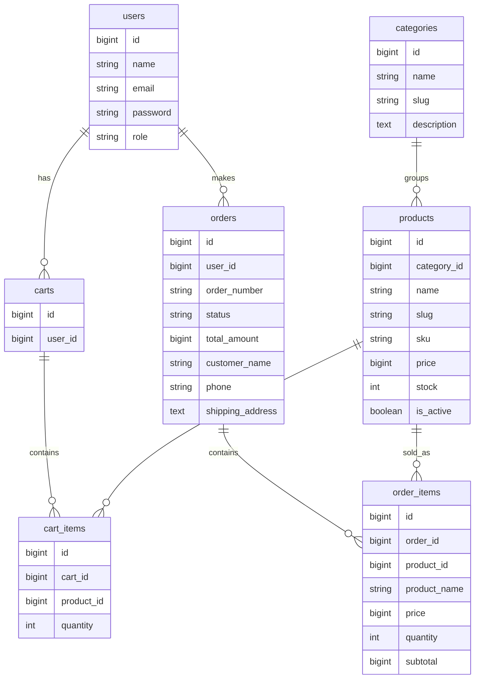
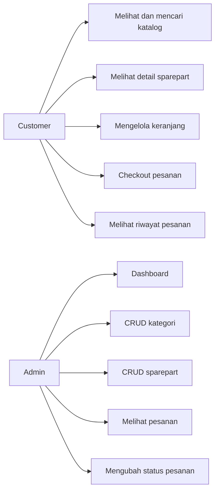

# Dokumentasi MotoPart Garage

## Ringkasan

MotoPart Garage adalah website bengkel dan penjualan sparepart motor berbasis Laravel, Blade, Bootstrap 5, dan MySQL. Sistem memiliki dua role: admin untuk mengelola data dan customer untuk belanja sparepart.

## ERD



## Use Case Diagram



## Struktur Folder Penting

- `app/Models`: model dan relasi `User`, `Category`, `Product`, `Cart`, `CartItem`, `Order`, `OrderItem`.
- `app/Http/Controllers`: controller auth, katalog, keranjang, checkout, dan pesanan customer.
- `app/Http/Controllers/Admin`: controller dashboard, kategori, sparepart, dan pesanan admin.
- `app/Http/Middleware/AdminMiddleware.php`: proteksi route khusus admin.
- `database/migrations`: migration tabel utama.
- `database/seeders/DatabaseSeeder.php`: akun demo dan data sparepart awal.
- `resources/views`: Blade customer, auth, admin, dan layout Bootstrap.
- `routes/web.php`: definisi route aplikasi.
- `tests/Feature/Iso25010Test.php`: test case ISO 25010.

## Cara Instalasi

1. Salin `.env.example` menjadi `.env`.
2. Atur koneksi MySQL:

```env
DB_CONNECTION=mysql
DB_HOST=127.0.0.1
DB_PORT=3306
DB_DATABASE=sparepart_motor
DB_USERNAME=root
DB_PASSWORD=
```

3. Buat database MySQL:

```sql
CREATE DATABASE sparepart_motor;
```

4. Jalankan perintah:

```bash
composer install
php artisan key:generate
php artisan migrate --seed
php artisan storage:link
php artisan serve
```

5. Buka aplikasi di `http://127.0.0.1:8000`.

## Akun Demo

- Admin: `admin@motopart.test` / `password`
- Customer: `customer@motopart.test` / `password`

## Test Case ISO 25010

| Karakteristik | Skenario |
| --- | --- |
| Functional Suitability | Customer mencari sparepart, menambahkan ke keranjang, checkout, dan stok berkurang. |
| Usability | Halaman katalog menampilkan navbar, CTA login/register, pencarian, dan produk. |
| Reliability | Checkout ditolak saat kuantitas melebihi stok agar data pesanan tidak rusak. |
| Security | Customer tidak dapat membuka dashboard admin dan password tersimpan hashed. |
| Performance Efficiency | Katalog memakai pagination sehingga dataset besar tetap dibatasi per halaman. |

Jalankan test:

```bash
php artisan test
```
