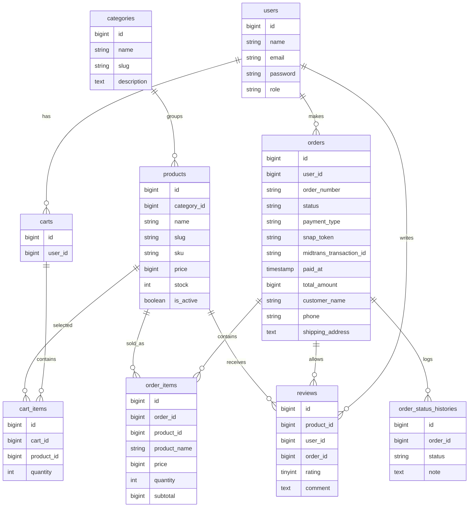
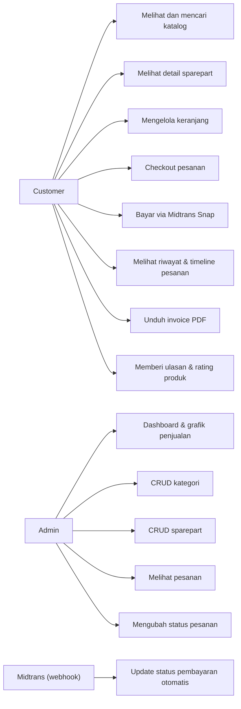

# Dokumentasi MotoPart Garage

## Ringkasan

MotoPart Garage adalah website bengkel dan penjualan sparepart motor berbasis Laravel, Blade, Bootstrap 5, dan MySQL. Sistem memiliki dua role: admin untuk mengelola data dan customer untuk belanja sparepart. Selain alur belanja dasar, tersedia pembayaran online (Midtrans Snap), ulasan produk, invoice PDF, timeline status pesanan, notifikasi email, dan dashboard analitik untuk admin.

## ERD



## Use Case Diagram



## Fitur Tambahan

- **Pembayaran online (Midtrans Snap sandbox)** — checkout mengarahkan customer ke halaman pembayaran Snap. Status order otomatis diperbarui via webhook `POST /midtrans/callback` saat pembayaran berhasil/gagal/kedaluwarsa. Stok dikembalikan otomatis bila pembayaran dibatalkan/kedaluwarsa. Karena webhook butuh URL publik (tidak bisa menjangkau `localhost` tanpa tunnel seperti ngrok), aplikasi juga punya jalur cadangan `App\Services\MidtransPaymentSync::refreshFromGateway()`: dipanggil otomatis setiap kali customer membuka halaman detail pesanan yang masih pending, dan bisa dipicu manual lewat tombol "Cek Status Pembayaran".
- **Ulasan & rating produk** — customer bisa memberi rating 1-5 dan komentar untuk sparepart dari pesanan yang sudah berstatus `completed`. Rata-rata rating ditampilkan di halaman detail produk.
- **Timeline status pesanan** — setiap perubahan status (manual oleh admin maupun otomatis dari Midtrans) dicatat di tabel `order_status_histories` dan ditampilkan sebagai riwayat di halaman detail pesanan.
- **Invoice PDF** — customer/admin bisa mengunduh invoice pesanan dalam format PDF (`barryvdh/laravel-dompdf`).
- **Notifikasi email** — email otomatis dikirim saat order dibuat dan setiap kali status order berubah (`App\Notifications\OrderCreated`, `App\Notifications\OrderStatusUpdated`), dikirim lewat queue (`QUEUE_CONNECTION=database`).
- **Dashboard analitik admin** — grafik omzet 14 hari terakhir, distribusi status pesanan, dan 5 sparepart terlaris memakai Chart.js.

## Struktur Folder Penting

- `app/Models`: model dan relasi `User`, `Category`, `Product`, `Cart`, `CartItem`, `Order`, `OrderItem`, `OrderStatusHistory`, `Review`.
- `app/Http/Controllers`: controller auth, katalog, keranjang, checkout, pembayaran, invoice, ulasan, dan pesanan customer.
- `app/Http/Controllers/Admin`: controller dashboard, kategori, sparepart, dan pesanan admin.
- `app/Http/Middleware/AdminMiddleware.php`: proteksi route khusus admin.
- `app/Notifications`: `OrderCreated` dan `OrderStatusUpdated` untuk email transaksional.
- `database/migrations`: migration tabel utama.
- `database/seeders/DatabaseSeeder.php`: akun demo, data sparepart, dan satu pesanan contoh yang sudah selesai + ulasan.
- `resources/views`: Blade customer, auth, admin, dan layout Bootstrap.
- `routes/web.php`: definisi route aplikasi.
- `tests/Feature/Iso25010Test.php`: test case ISO 25010.

## Cara Instalasi

1. Salin `.env.example` menjadi `.env`.
2. Atur koneksi MySQL:

```env
DB_CONNECTION=mysql
DB_HOST=127.0.0.1
DB_PORT=3306
DB_DATABASE=sparepart_motor
DB_USERNAME=root
DB_PASSWORD=
```

3. Buat database MySQL:

```sql
CREATE DATABASE sparepart_motor;
```

4. (Opsional, untuk pembayaran) Daftar akun sandbox gratis di [dashboard sandbox Midtrans](https://dashboard.sandbox.midtrans.com/register), lalu isi `MIDTRANS_SERVER_KEY` dan `MIDTRANS_CLIENT_KEY` di `.env`. Tanpa ini, halaman pembayaran tetap tampil tapi tombol "Bayar Sekarang" dinonaktifkan.

5. Jalankan perintah:

```bash
composer install
php artisan key:generate
php artisan migrate --seed
php artisan storage:link
php artisan serve
```

6. Buka aplikasi di `http://127.0.0.1:8000`.

7. (Opsional, untuk email & notifikasi status) Jalankan queue worker di terminal terpisah:

```bash
php artisan queue:work
```

## Akun Demo

- Admin: `admin@motopart.test` / `password`
- Customer: `customer@motopart.test` / `password` (sudah punya 1 pesanan `completed` dengan ulasan contoh)

## Test Case ISO 25010

| Karakteristik | Skenario |
| --- | --- |
| Functional Suitability | Customer mencari sparepart, menambahkan ke keranjang, checkout, dan stok berkurang. |
| Usability | Halaman katalog menampilkan navbar, CTA login/register, pencarian, dan produk. |
| Reliability | Checkout ditolak saat kuantitas melebihi stok agar data pesanan tidak rusak. |
| Security | Customer tidak dapat membuka dashboard admin dan password tersimpan hashed. |
| Performance Efficiency | Katalog memakai pagination sehingga dataset besar tetap dibatasi per halaman. |

Jalankan test:

```bash
php artisan test
```
